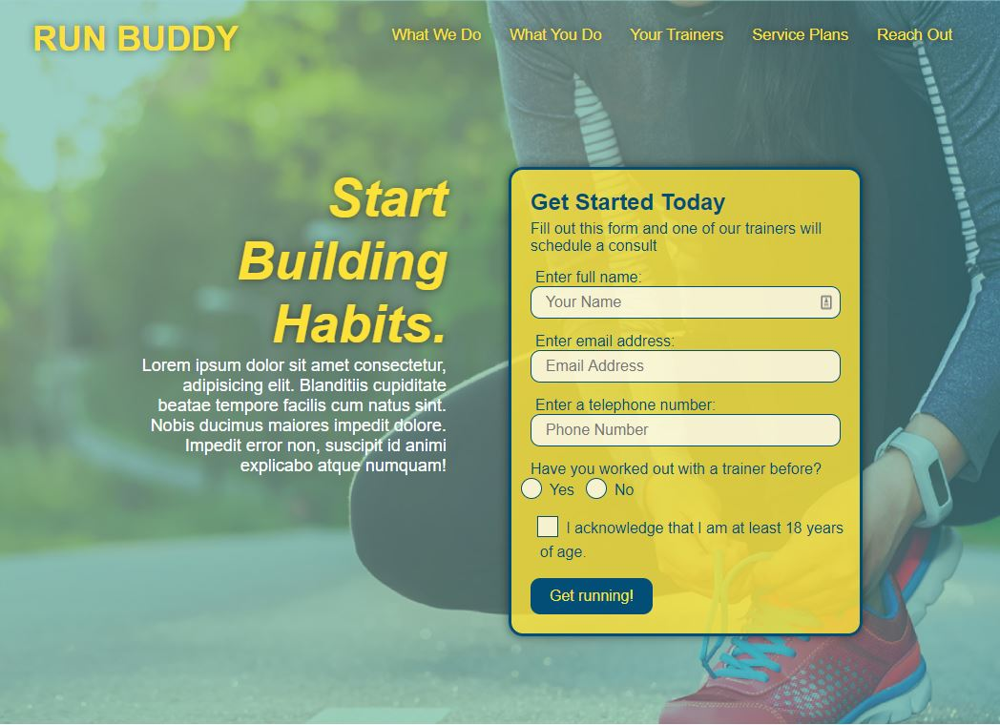

# Run Buddy, Inc

## Purpose
A website that offers fitness training services. 

## Features
When the user launches the site they are provided with a landing page that shows how to sign up, what the user is signing up for, who they will be working with, as well as the costs. They are also able to utilize a contact form for instant communication.

## Built With
* HTML
* CSS

## Website
https://jennifermulder.github.io/run-buddy/

## Project Status
The Run Buddy site is compliant with defined acceptance criteria

## Contribution
Made with ❤️ by Jennifer Mulder

### ©️2019 Run Buddy, Inc 
